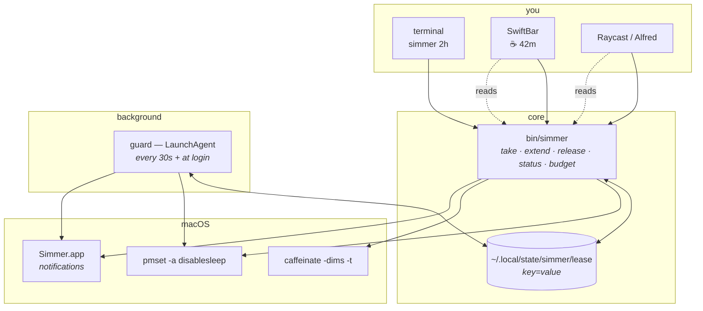

# Architecture

simmer is one bash script, one LaunchAgent, one state file, and three optional
front-ends. That is the whole system, and keeping it that small is deliberate:
the thing it guards is a switch that can flatten a battery, so the code that
guards it should fit in your head.

## The pieces



`bin/simmer` is the only thing that writes the lease or touches `pmset`. Every
front-end shells out to it — none of them reimplement any logic, and none of
them read the lease file directly. That is why adding a fourth front-end costs
nothing and cannot introduce a new bug class.

## The lease

A flat `key=value` file at `~/.local/state/simmer/lease`. Flat, not JSON, so the
menu bar and the launcher scripts can read it without making `jq` a
prerequisite for seeing a countdown.

```
format=1            bump this if the shape ever changes
until=1787254800    epoch seconds; 0 means no deadline
started=1787247600
reason=overnight build
min_battery=20
caffeinate=41234    pid of the second clock
warned=0            so the 5-minute warning fires exactly once
reminded=1787247600 last reminder, for open-ended leases
owner=terminal      terminal · script · menubar · raycast · alfred · agent
```

The lease is written to a temp file and renamed, never edited in place, so the
guard can never read half a lease and conclude it is corrupt.

`simmer --porcelain` is the **public contract** for anything rendering this
state. The field names are part of the interface; `format` exists so a future
change is detectable instead of silently misread.

## Why the guard is a LaunchAgent

Handing the switch back must not depend on a terminal you closed or a process
you killed. `StartInterval 30` plus `RunAtLoad` gives two properties that matter
more than precision:

- **30 seconds of slack** on a deadline is invisible; a tick costs a few
  milliseconds of CPU, which is nothing next to keeping the machine awake at all.
- **`RunAtLoad`** means that a `disablesleep` left over from a crash, or typed by
  hand, is reverted at the next login.

The guard uses `sudo -n` and never anything else. A watchdog that *can* prompt
for a password is a watchdog that hangs on an invisible prompt while the machine
stays awake — so when the sudoers rule is missing it logs and notifies the
failure rather than waiting.

`caffeinate -dims -t <seconds>` runs alongside as a second, independent clock.
It cannot hold the lid, but if the guard ever dies, that timer still expires. It
runs under `nohup`, because otherwise closing the terminal that started the
lease would take it with them.

## Notifications

A notification's name and icon come from the bundle that posts it, and from
nothing else. `osascript` posts as **Script Editor** — a quill icon, a
misleading name, and dropped silently if Script Editor's notifications are off.

So `make install` compiles `assets/notifier.applescript` into
`~/Applications/Simmer.app`, sets its bundle id and icon, and simmer launches
that. Content passes through a file rather than arguments, because
`open --args` does **not** reach an applet's `on run argv` — tested; it does not
arrive. Script Editor remains the fallback: worse-looking, but a notification
that looks wrong still beats one that never appears.

The sound is not decoration. It is the channel that still carries when banners
are suppressed, and the menu bar is the indicator nothing can drop.

## One health check, two entry points

`simmer doctor` is the health report, and it is the *only* implementation. It
covers the running system — guard loaded, sudo rule allowed, notifier present
and carrying the icon, state writable — and works with no repo checked out,
because it is the installed binary talking about the machine.

`make check` adds the three things only a checkout can know (is the symlink
pointing here, is `$PREFIX` on `PATH`, is the installed LaunchAgent still
identical to the template) and then calls `simmer doctor` for the rest. Two
health reports covering the same ground is two reports that drift, and the one
you happen to run is the one you believe.

## The test seam

Four functions — `sleep_disabled`, `set_disablesleep`, `battery_percent`,
`on_battery` — are the only places that read or write power state, so the suite
can substitute them:

| Variable | Effect |
|---|---|
| `SIMMER_FAKE_PMSET=<file>` | the switch is that file's contents (`0`/`1`) instead of real `pmset` |
| `SIMMER_FAKE_BATTERY=<pct>:<on_battery>` | e.g. `12:1` — 12%, on battery |

Without this, testing the guard needs root, changes the machine under you, and
the battery branch is untestable whenever the laptop is charging. With it,
`make test` is 43 assertions that touch nothing.

## Deliberately not here

- **No daemon of its own.** launchd already is one.
- **No config file.** Flags plus two defaults (20% floor, 30s tick) have covered
  every case so far. Named presets would be the first thing to add if that changes.
- **No JSON.** See the lease format above.
- **No Homebrew formula yet.** `make install` is two commands and honest about
  the one that needs root.
- **No `simmer run -- <cmd>`.** A lease scoped to a process lifetime is the most
  obvious next feature, and it is purely additive, so it can wait until someone
  wants it.
