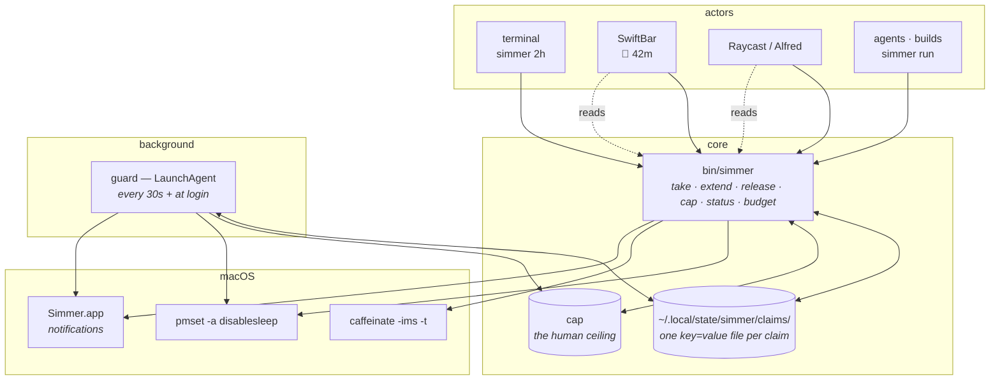

# Architecture

simmer is one bash script, one LaunchAgent, a directory of small state files, and
three optional front-ends. That is the whole system, and keeping it that small is
deliberate: the thing it guards is a switch that can flatten a battery, so the
code that guards it should fit in your head.

## The pieces



`bin/simmer` is the only thing that writes the ledger or touches `pmset` — and
since v1.1 it also **renders every surface**: `simmer render swiftbar|raycast|alfred`
produces the menu bar text, the launcher line and the Alfred JSON. The files in
`integrations/` are shims of a dozen lines carrying only each host's metadata and
a resolver. The previous design, with three separate renderers parsing the same
state, produced six copies of a resolver and two Raycast commands that shipped
dead — a fourth surface now costs a case branch in the core, tested where
everything else is.

## Awake time is counted, not owned

The v1 design was one lease with an owner. That forces a whole user interface into
existence: two actors wanting awake time at once means refusals, a `--force` flag,
and a rule about who may stamp over whom. And it is the wrong shape for the
machine it runs on — this Mac routinely has a person, an agent and a build all
wanting the lid to stay shut, which is also how power management itself works,
since assertions are counted and not a switch.

So there is a **ledger**: one file per claim under `claims/`, and the machine
stays awake until the latest live one ends.

```
claims/terminal    👤  refactor            until 17:00
claims/agent       🤖  eval batch          until 15:45
claims/run:4821    ⚙   npm test            until 15:20
                                           ─────────────
cap                ⛔  nothing past        23:00
                                           ─────────────
the machine sleeps at                      17:00
```

**A claim's id is its owner.** That is the entire ownership model, and it is what
makes "extend my claim", "release my claim" and "replace my claim" need no
registry and be impossible to get wrong: one actor physically cannot address
another's file. The cost is that an actor holds at most one claim, which is what
everyone wants anyway — `simmer 2h` twice from the same terminal should move a
deadline, not accumulate two of them. Actors that genuinely are several things
put their pid in their identity (`run:4821`), and concurrent agents should
namespace themselves the same way (`--owner agent:funnel`).

`--force` is gone as a *concept*, not merely deprecated: there is no code path in
which one actor's claim can be replaced by another's. Contract guarantee 4 got
stronger rather than weaker.

## The cap — the one thing only a human sets

Claims request awake time from below. The cap rules from above: `simmer cap 23:00`
clips every claim, the ones already held and the ones taken later. An agent that
runs into it gets a truthful `budget` answer — `capped: true`, and prose saying
asking for longer will not help — rather than an error to route around.

A cap whose time has passed keeps refusing new claims until a human moves or lifts
it. Letting it expire quietly would be the friendlier behaviour and the wrong
one: it would throw away a decision a person made on purpose, which is the exact
failure this tool exists to prevent. Every surface says the cap is there and how
to lift it, so it is a visible gate rather than a trap.

Human primacy is enforced *against honest actors*, not as a security boundary.
Nothing stops a process passing `--owner terminal`, and on a single-user Mac
nothing could. What it buys is that an agent following the protocol cannot take a
human's time away by accident — which is the failure that actually happens.

## A claim

A flat `key=value` file at `~/.local/state/simmer/claims/<id>`. Flat, not JSON, so
the menu bar and the launcher scripts can read it without making `jq` a
prerequisite for seeing a countdown.

```
format=2            bump this if the shape ever changes
id=agent            the filename; derived from owner
owner=agent         terminal · menubar · raycast · alfred · agent · run:<pid>
until=1787254800    epoch seconds; 0 means no deadline
started=1787247600
reason=overnight build
min_battery=20
caffeinate=41234    pid of the second clock
require_ac=0        end the claim if the charger disappears
warned=0            so the 5-minute warning fires exactly once
prewarned=0         so the floor+10% warning does too
reminded=1787247600 last reminder, for open-ended claims
```

Written to a temp file and renamed, never edited in place, so the guard can never
read half a claim and conclude it is corrupt.

`simmer status --machine` and `--json` are the **public contract** for anything
rendering this state. `format` exists so a future change is detectable instead of
silently misread; a `format=1` lease from before the ledger is read once,
converted into a claim, and deleted.

## One function owns the switch

Every mutation — take, extend, release, cap, each guard tick — ends in `settle`,
which reads the aggregate and puts `disablesleep` where the ledger says it
belongs. Nothing else flips it.

That is what turns contract guarantee 2 from a promise into a property. A claim
can be added or retired anywhere in the code; the invariant is maintained in one
place instead of at every call site, so "no path leaves the switch on without
something scheduled to turn it off" is checkable by reading a single function.

The banner rule follows the same idea from the other end: the human hears about
the **aggregate**, never about individual claims. `settle` announces the switch
going back; take and extend compare the aggregate before and after and stay quiet
when it did not move. So an agent claiming an hour inside a human's two hours
changes nothing anybody needs told — and notification spam is how a tool teaches
people to ignore it.

## Why the guard is a LaunchAgent

Handing the switch back must not depend on a terminal you closed or a process you
killed. `StartInterval 30` plus `RunAtLoad` gives two properties that matter more
than precision:

- **30 seconds of slack** on a deadline is invisible; a tick costs a few
  milliseconds of CPU, which is nothing next to keeping the machine awake at all.
- **`RunAtLoad`** means that a `disablesleep` left over from a crash, or typed by
  hand, is reverted at the next login.

With a ledger it retires claims one at a time, so a machine held awake by three
actors comes down in three steps rather than all-or-nothing, and the last claim
out turns the light off. Each claim is measured against **its own** floor: an
actor asking for `--min-battery 60` gets exactly that without dragging everyone
else's time down with it, and with the default floor everywhere — the normal case
— they all go together anyway.

Heat is the exception and ends every claim at once. It is a fact about the
machine, not about anybody's plan for it.

The guard uses `sudo -n` and never anything else. A watchdog that *can* prompt
for a password is a watchdog that hangs on an invisible prompt while the machine
stays awake — so when the sudoers rule is missing it logs and notifies the
failure rather than waiting.

`caffeinate -ims -t <seconds>` runs alongside each claim as a second, independent
clock. It cannot hold the lid, but if the guard ever dies, that timer still
expires. It runs under `nohup`, because otherwise closing the terminal that
started the claim would take it with it.

## Notifications

macOS attributes a banner to the **bundle** that posts it, drops banners from
identities it does not recognise, and caches a permission denial per bundle id
forever. Those three rules explain every dead end below, and the solution:

- `osascript` → attributed to Script Editor (quill, often suppressed)
- an AppleScript applet → attributed to the OSA host, not the applet
- `terminal-notifier` → its own identity is never shown; `-sender` borrows an
  installed app's identity and works, but the icon is theirs
- **an installed, LaunchServices-registered, ad-hoc-signed app bundle → works.**
  No certificate needed (verified by A/B against a trusted self-signed cert).
  The one-time permission request arrives as a banner carrying the bundle's own
  icon; one click on Allow finishes the setup.

So `install.sh` compiles `notifier/main.swift` into `~/Applications/Simmer.app`
with the pot icon and the id `io.github.moralesl.simmer` — an id that must never
be reused after a denial, because the cached verdict outlives every rebuild.
The binary answers `--status` (authorized / notDetermined / denied) so `doctor`
asks instead of guessing, and exits non-zero when not authorized so `notify()`
falls back to `osascript` and the message still lands somewhere.

The transport remains a setting (`SIMMER_NOTIFY`), with `simmer notify-test`
firing one labelled banner per transport — anything OS-version-dependent should
be switchable and self-testing rather than baked in.

The sound is not decoration: it carries when banners are suppressed, and the
menu bar is the indicator nothing can drop.

## Sleep, and which kinds

`caffeinate -ims` by default: idle, system and disk sleep are held, **display
sleep is not**. You took a claim because you are walking away, so keeping a
screen lit costs exactly the battery the floor exists to protect — and with the
lid shut it is off anyway. `--display-on` adds `-d` for demos and kiosks.

`pmset -a disablesleep` is the separate, privileged part, and the only thing that
holds the lid. caffeinate runs alongside as a second, independent clock that
expires on its own via `-t`.

## The test seam

Every reading of power state and of **time** goes through a substitutable
function, so the suite can replace them:

| Variable | Effect |
|---|---|
| `SIMMER_FAKE_PMSET=<file>` | the switch is that file's contents (`0`/`1`) instead of real `pmset` |
| `SIMMER_FAKE_BATTERY=<pct>:<on_battery>` | e.g. `12:1` — 12%, on battery |
| `SIMMER_FAKE_THERMAL=<0\|N>` | thermal warning level |
| `SIMMER_FAKE_LOCKDELAY=<seconds>` | the screen-lock grace period |
| `SIMMER_FAKE_NOW=<epoch>` | the clock. Relative arithmetic reads from it; `date -r` formatting is unaffected |
| `SIMMER_HUMAN=1` | the caller carries human authority regardless of owner |

Without the power seam, testing the guard needs root, changes the machine under
you, and the battery branch is untestable whenever the laptop is charging.

`SIMMER_FAKE_NOW` earns its place separately. Nine `date +%s` call sites made
warn-once, the reminder interval and deadline crossings reachable only by
hand-writing timestamps into state files — which tests the fixture rather than the
code, and is exactly the set of paths a differential run between two
implementations has to compare.

With both, `make test` runs the whole suite and touches nothing.

## Two suites, two jobs

- `make test` — is this implementation internally right? Point `SIMMER_BIN` at any
  binary and it must go green; that is the acceptance test for a reimplementation.
- `make diff` — do two implementations agree? Identical CLI scenarios against two
  binaries, normalised and diffed. It is the only instrument that catches a
  message, an exit code, a field name or a state value drifting during a port,
  because that is the class of change where every individual test still passes.

The differential encodes contract guarantee 5 directly: contract-bearing lines
(exit codes, `key=value`, JSON) must match exactly, prose differences are
reported and allowed. Scenarios that are *supposed* to differ are declared as
such, so a delta that quietly stops being a delta is as much a finding as a new
one.

## Deliberately not here

- **No daemon of its own.** launchd already is one.
- **No config file.** Flags plus three defaults (20% floor, 30s tick, 10-point
  pre-floor margin) have covered every case so far. Named presets would be the
  first thing to add if that changes.
- **No JSON on disk.** See the claim format above. JSON *out* is a different
  question, and `--json` answers it.
- **No per-claim thermal or cap settings.** Heat and the human's ceiling are
  facts about the machine and its owner, not parameters of a claim.
- **No Homebrew formula yet.** `make install` is two commands and honest about
  the one that needs root.
